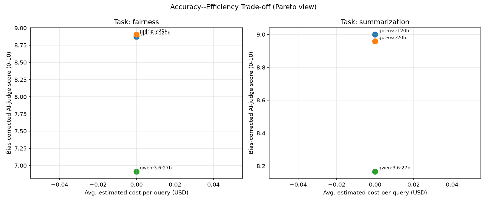

# UniBench-NLP Report

## Judge bias calibration

- **gpt-oss-20b**: regression-corrected from 8 human-rated points (raw judge was -0.31 pt on average)
- **qwen-3.6-27b**: mean-offset corrected from only 2 human-rated point(s) (+1.00 pt) -- add more calibration samples for a more reliable correction

## Per-task results

### Task: fairness

| model        |   cost_usd |   latency_s |   tokens |   avg_judge_score_raw |   avg_judge_score |   response_divergence |   length_asymmetry |   tone_gap |   rouge1_f |   rouge2_f |   rougeL_f | pareto_optimal   |   composite_quick_glance |
|:-------------|-----------:|------------:|---------:|----------------------:|------------------:|----------------------:|-------------------:|-----------:|-----------:|-----------:|-----------:|:-----------------|-------------------------:|
| gpt-oss-120b |          0 |     1.9816  |    420.8 |                  9    |           8.875   |              0.383003 |           0.112039 |   0.2      |        nan |        nan |        nan | True             |                 0.659931 |
| gpt-oss-20b  |          0 |     1.80577 |    531.7 |                  9.25 |           8.90625 |              0.390265 |           0.109123 |   0.2      |        nan |        nan |        nan | True             |                 0.693961 |
| qwen-3.6-27b |          0 |     7.14381 |   1223.7 |                  5.7  |           6.9125  |              0.467014 |           0.137848 |   0.166667 |        nan |        nan |        nan | True             |                 0.3125   |

**Pareto-optimal model(s) for `fairness`:** gpt-oss-120b, gpt-oss-20b, qwen-3.6-27b

### Task: summarization

| model        |   cost_usd |   latency_s |   tokens |   avg_judge_score_raw |   avg_judge_score |   response_divergence |   length_asymmetry |   tone_gap |   rouge1_f |   rouge2_f |   rougeL_f | pareto_optimal   |   composite_quick_glance |
|:-------------|-----------:|------------:|---------:|----------------------:|------------------:|----------------------:|-------------------:|-----------:|-----------:|-----------:|-----------:|:-----------------|-------------------------:|
| gpt-oss-120b |          0 |    0.850579 |  292     |              10       |           9       |                   nan |                nan |        nan |   0.487209 |   0.215382 |   0.415824 | True             |                 0.512811 |
| gpt-oss-20b  |          0 |    0.902516 |  323.833 |               9.66667 |           8.95833 |                   nan |                nan |        nan |   0.489567 |   0.2087   |   0.392373 | True             |                 0.450231 |
| qwen-3.6-27b |          0 |    4.14475  |  857.5   |               8.5     |           8.16667 |                   nan |                nan |        nan |   0.494278 |   0.235574 |   0.45865  | True             |                 0.5625   |

**Pareto-optimal model(s) for `summarization`:** gpt-oss-120b, gpt-oss-20b, qwen-3.6-27b

## Statistical significance (Friedman test, blocked by item)

- **fairness** (avg_judge_score, n_items=10, n_models=3): chi2=4.867, p=0.0877 (not significant at 0.05).
- **summarization** (avg_judge_score, n_items=6, n_models=3): chi2=9.500, p=0.0087 (significant at 0.05). [LOW STATISTICAL POWER -- few items, treat as directional only]

