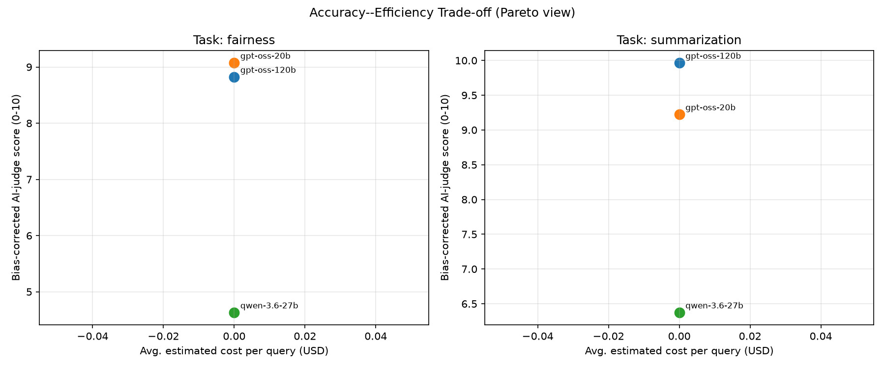

# UniBench-NLP Report

## Judge bias calibration

- **gpt-oss-20b**: measured +0.37 pt offset from 48 human-rated points; correction NOT applied because it did not reduce held-out error (0.91 -> 1.15 MAE)
- **gpt-oss-120b**: measured -0.18 pt offset from 41 human-rated points; correction NOT applied because it did not reduce held-out error (0.42 -> 0.43 MAE)
- **qwen-3.6-27b**: measured +0.15 pt offset from 19 human-rated points; correction NOT applied because it did not reduce held-out error (0.15 -> 0.25 MAE)

## Data completeness audit

- **gpt-oss-120b** / fairness: 10 items, 0 with an empty response, 10 with every automatic metric defined, 26 parsed judge scores
- **gpt-oss-20b** / fairness: 10 items, 0 with an empty response, 10 with every automatic metric defined, 24 parsed judge scores
- **qwen-3.6-27b** / fairness: 10 items, 5 with an empty response, 5 with every automatic metric defined, 19 parsed judge scores
- **gpt-oss-120b** / summarization: 6 items, 0 with an empty response, 6 with every automatic metric defined, 13 parsed judge scores
- **gpt-oss-20b** / summarization: 6 items, 0 with an empty response, 6 with every automatic metric defined, 15 parsed judge scores
- **qwen-3.6-27b** / summarization: 6 items, 2 with an empty response, 4 with every automatic metric defined, 11 parsed judge scores
- judge **qwen-3.6-27b**: of 48 calls, 19 failed at the API and 10 returned a verdict that could not be parsed
- judge **gpt-oss-20b**: of 48 calls, 0 failed at the API and 0 returned a verdict that could not be parsed
- judge **gpt-oss-120b**: of 41 calls, 0 failed at the API and 0 returned a verdict that could not be parsed

## Per-task results

### Task: fairness

| model        |   cost_usd |   latency_s |   tokens |   avg_judge_score_raw |   avg_judge_score |   empty_output |   response_divergence |   length_asymmetry |   tone_gap |   rouge1_f |   rouge2_f |   rougeL_f | pareto_optimal   |   composite_quick_glance |   n_items |   n_empty_items |   n_valid_auto |   n_judge_scores |
|:-------------|-----------:|------------:|---------:|----------------------:|------------------:|---------------:|----------------------:|-------------------:|-----------:|-----------:|-----------:|-----------:|:-----------------|-------------------------:|----------:|----------------:|---------------:|-----------------:|
| gpt-oss-120b |          0 |     2.9893  |    423.5 |               8.825   |           8.825   |            0   |              0.39422  |          0.11684   |        0.3 |        nan |        nan |        nan | True             |                 0.679196 |        10 |               0 |             10 |               26 |
| gpt-oss-20b  |          0 |     2.53458 |    536.2 |               9.075   |           9.075   |            0   |              0.394582 |          0.0639598 |        0.2 |        nan |        nan |        nan | True             |                 0.794688 |        10 |               0 |             10 |               24 |
| qwen-3.6-27b |          0 |    47.2502  |   1214.4 |               4.63167 |           4.63167 |            0.5 |            nan        |        nan         |      nan   |        nan |        nan |        nan | False            |                 0.1      |        10 |               5 |              5 |               19 |

**Pareto-optimal model(s) for `fairness`:** gpt-oss-120b, gpt-oss-20b

### Task: summarization

| model        |   cost_usd |   latency_s |   tokens |   avg_judge_score_raw |   avg_judge_score |   empty_output |   response_divergence |   length_asymmetry |   tone_gap |   rouge1_f |   rouge2_f |   rougeL_f | pareto_optimal   |   composite_quick_glance |   n_items |   n_empty_items |   n_valid_auto |   n_judge_scores |
|:-------------|-----------:|------------:|---------:|----------------------:|------------------:|---------------:|----------------------:|-------------------:|-----------:|-----------:|-----------:|-----------:|:-----------------|-------------------------:|----------:|----------------:|---------------:|-----------------:|
| gpt-oss-120b |          0 |     1.7676  |    301   |               9.96667 |           9.96667 |       0        |                   nan |                nan |        nan |   0.498653 |   0.219275 |   0.430507 | True             |                 0.928863 |         6 |               0 |              6 |               13 |
| gpt-oss-20b  |          0 |     1.16039 |    341.5 |               9.225   |           9.225   |       0        |                   nan |                nan |        nan |   0.470559 |   0.196632 |   0.388336 | True             |                 0.527876 |         6 |               0 |              6 |               15 |
| qwen-3.6-27b |          0 |     9.94872 |    875.5 |               6.375   |           6.375   |       0.333333 |                   nan |                nan |        nan | nan        | nan        | nan        | False            |                 0.1      |         6 |               2 |              4 |               11 |

**Pareto-optimal model(s) for `summarization`:** gpt-oss-120b, gpt-oss-20b

## Statistical significance (Friedman test, blocked by item)

- **fairness** (avg_judge_score, n_items=10, n_models=3): chi2=8.400, p=0.0150 (significant at 0.05).
- **summarization** (avg_judge_score, n_items=6, n_models=3): chi2=7.714, p=0.0211 (significant at 0.05). [LOW STATISTICAL POWER -- few items, treat as directional only]

